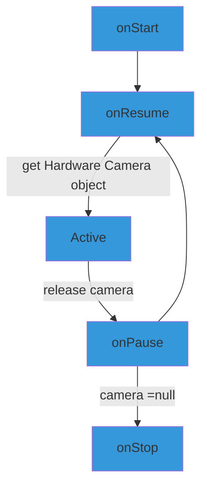

# Flashlight

**Title** Flashlight  
**Start@** 2016-03-10

카메라 플레시 제어 어플  
On/Off time 만을 제어하도록 하는 간단하고 단순한 앱.  
프로젝트를 완전히 새로(with blank activity) 만들어서 시작할 것.

완료 이후에는 동일한 UX를 이용하여 진동 제어 앱도 만들 것.  
FingerBrickBreaker 작업에 지쳐 있음 → Refresh 필요 → 완전 단순한 앱 생성.
>생각보다 간단하지 아니하다.
>항상 그러하듯이.....

##ToDo
- **Seek bar**
 - sceneTouch.isUp → adjust key position via step. [적용 완료]
- Application.onDestroy()에서 카메라를 null 처리할 때 에러 발생
 - 현재 : 임시 방안으로 **try/catch** 로 에러가 보여지는 것만 맊았음.
 - 해결 방안 찾아서 적용해야 함.
- 배포판 apk 생성전에 **Log 메세지** 모두 주석 처리할 것.

##Issue Tracking
- OnOff button 완료
 - 2016-03-19
- Light on effect 적용 
 - 2016-03-19
 - Blink 에 대해서 확인해야 함.

## SeekBar
- Touch Event 발생 시에 onChanged 를 호출
- Home scene에서는 sceneTouch LIstener 의 action up을 체크해서 이때에만 뭔가를 하게 할 것.
 - 그냥 onSeekChanged 에서 **on/off inverval** 을 바로 변경해도 될 듯

## Service

- ~~Light On 상태에서 pause 일때에는 Notification 을 띄울 것. (on 상태의 값을 extra로 전달하여 그대로 전달)~~
- pause/stop 시에는 무조건 플래쉬를 끄고 카메라 **release** 해야함.
- onPause()에서 IntentService 만 start → self ad purpose

## Hardware Camera

### Life cycle



##광고
###Interstitial ad
광고 노출 빈도를 낮게 할 것
###Banner ad
*Random*으로 노출하도록 할 것
→ Handler를 이용해서 일정 시간 간격으로 밑에서 올라왔다가 내려가도록 할 것.

- 노출 위치를 admob 바로 위로 하고 **company text** 는 admob 위치에 놓을 것.

###Family ad
Background service를 이용해서 어쩌다 한번 내 앱(특히 Jumpy X) 에 대해서 Notification 형태로 광고할 것.

##Market Share Star
항상 보이게 하지 말고 앱을 켠 뒤 일정 시간 뒤에 Attach 할 것.  
Attach 했을 때의 효과가 그리 크지 않을 것 같음.

##Effect
구성 요소들의 Effect를 너무 과하게 주지는 말 것.
### OnOff Button click effect
- Holo effect when isActionDown

##Notification text

**++BackUp++**
```
	<string name="noti_title_jumpyx">Jumpy X</string>
    <string name="noti_title_circlecolormatch">Circle</string>
    <string name="noti_title_brainwavestudio">Brainwave Studio : EEG Gen</string>
    <string name="noti_title_naturesound">Nature Meditation Sounds</string>
    <string name="noti_title_lottonumgenall">Lotto Prophet</string>
    <string name="noti_title_lottonum645only">Lotto645</string>
    <string name="noti_title_mathkids">Math Kids</string>
    <string name="noti_title_moodvibrator">Mood Vibrator</string>
    <string name="noti_title_skinvibrator">Skin Vibrator</string>
    <string name="noti_title_unitconverter">Unit converter</string>
    
    <string name="noti_desc_jumpyx">Jump with JumpyX</string>
    <string name="noti_desc_circlecolormatch">Color matching game</string>
    <string name="noti_desc_brainwavestudio">You can tune your brainwave</string>
    <string name="noti_desc_naturesound">Take a rest and get a peace.</string>
    <string name="noti_desc_lottonumgenall">Win the Lotto</string>
    <string name="noti_desc_lottonum645only">Win the Lotto645</string>
    <string name="noti_desc_mathkids">Basic mathematics for Kids</string>
    <string name="noti_desc_moodvibrator">Free vibration app</string>
    <string name="noti_desc_skinvibrator">Free vibration app</string>
    <string name="noti_desc_unitconverter">You can convert all kind of units</string>

```


